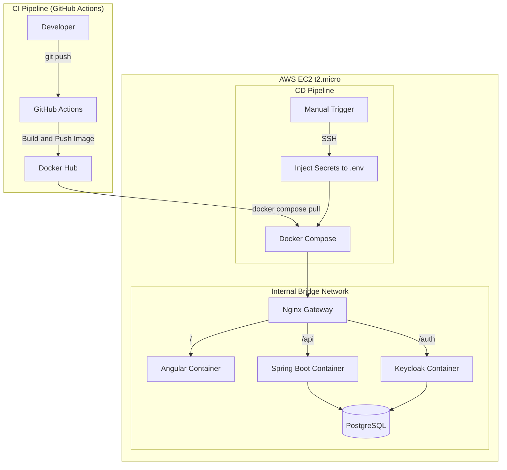

# Secure Docs — Infrastructure & Deployment

> **Cloud-agnostic deployment template** for a containerized full-stack application.
> Manages orchestration, secrets injection, and CI/CD pipelines separately from application code.

---

## Strategy

The pipeline follows a **"Build Once, Run Anywhere"** model using Docker Hub as the artifact registry.

| Repository | Responsibility |
|---|---|
| `secure-docs-backend` | CI only — builds and pushes Docker image |
| `secure-docs-frontend` | CI only — builds and pushes Docker image |
| `secure-docs-deploy` *(this repo)* | CD only — orchestration, secrets, server management |

---

## Architecture



---

## Design Decisions

**1. Why a separate deployment repo?**

Application repos are cloud-agnostic — they only produce Docker images.
Switching from AWS EC2 to any other provider requires changes only here.

**2. Why offload builds to GitHub Actions?**

A t2.micro (1GB RAM) is not suited for Maven or NPM compilation.
GitHub Actions handles the heavy build step; the server only runs `docker compose up`.

**3. Secrets handling**

Secrets are injected via SSH at deploy time into a `.env` file consumed by Docker Compose.
They are never stored in Git or Docker images.

---

## Deployment

```
Manual trigger → GitHub Actions → SSH → Inject secrets → docker compose pull → docker compose up -d
```

---

## Related Repositories

- [secure-docs-backend](https://github.com/Salamndir/secure-docs-backend) — Spring Boot API
- [secure-docs-frontend](https://github.com/Salamndir/secure-docs-frontend) — Angular SPA
